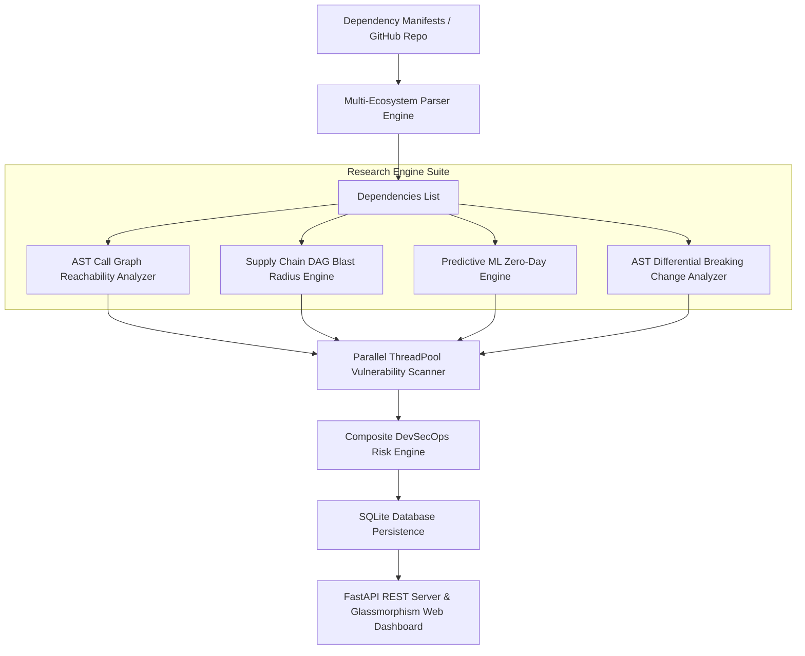

# 🛡️ DevSecOps Dependency Risk Analyzer

[](https://www.python.org/)
[](#-academic-research-innovations)
[](https://fastapi.tiangolo.com/)
[](https://osv.dev/)
[](https://cyclonedx.org/)
[](LICENSE)

An enterprise-grade, peer-review research-level **DevSecOps Dependency Risk Analyzer** built in Python and FastAPI. This project introduces novel program analysis techniques including **AST Call Graph Reachability Analysis** (false-positive elimination), **Supply-Chain DAG Blast-Radius Modeling**, **Machine Learning Zero-Day Exposure Prediction**, and **AST Differential Breaking-Change Analysis**.

---

## 🔬 Academic Research Innovations

This software incorporates 4 novel research-grade computer science engines designed for peer-reviewed academic publication:

### 1. 🧬 AST Call Graph Reachability Engine (`analyzer/research/reachability.py`)
- **Problem**: Traditional dependency scanners suffer from high false-positive rates by flagging installed libraries even if the application code never imports or invokes vulnerable functions.
- **Solution**: Uses Python's Abstract Syntax Tree (`ast`) parser to construct a static call graph of application entrypoints, cross-referencing imported modules and symbol calls against vulnerability advisories. Unused dependencies are marked `UNREACHABLE` and discounted from risk accumulation.

### 2. 🕸️ Supply-Chain DAG Blast-Radius Model (`analyzer/research/graph_engine.py`)
- **Problem**: Cascading transitive sub-dependencies obscure the true structural impact of supply-chain attacks.
- **Solution**: Models the dependency hierarchy as a **Directed Acyclic Graph (DAG)** and computes Graph Centrality (Depth, In/Out-degree) to quantify an individual package's **Blast Radius Score (0.0 – 100.0)**.

### 3. 🔮 Predictive ML Zero-Day & Maintainer Health Engine (`analyzer/research/ml_predictor.py`)
- **Problem**: Formal CVE publication lags behind zero-day exploits by weeks.
- **Solution**: Evaluates release staleness, major/minor version deprecation gaps, and EPSS exploit velocity signals to compute a **Predictive Zero-Day Exposure Index**.

### 4. 🤖 AST Differential Breaking-Change Analyzer (`analyzer/research/ast_diff.py`)
- **Problem**: Developers delay applying security patches out of fear of breaking application API contracts.
- **Solution**: Computes SemVer version deltas and inspects caller AST signatures to predict **Breaking Change Operational Risk (0.0 – 1.0)** before patch application.

---

## 📌 General Features

- **🌐 Multi-Ecosystem Support**: Parses Python (`requirements.txt`, `pyproject.toml`), Node.js (`package.json`), Java Maven (`pom.xml`), Go (`go.mod`), and Rust (`Cargo.lock`).
- **🔍 Multi-Engine Scanning**: Google OSV.dev REST API + Aqua Trivy CLI + FIRST.org EPSS exploitability ratings.
- **🖥️ Glassmorphism Web Dashboard**: Real-time browser UI at `http://127.0.0.1:8000` with Chart.js charts and live Academic Research Metrics panel.
- **📦 Enterprise Exporters & OWASP Integration**: CycloneDX v1.4 JSON SBOM, OWASP Dependency-Track REST API exporter, SARIF 2.1.0 for GitHub Code Scanning.

---

## 🏗️ System Architecture



---

## 🧮 Composite Risk Scoring Formula

The Risk Engine calculates dependency risk using:

$$R_{\text{dep}} = \max_{v \in \text{ReachableVulns}} \left( \text{CVSS}_v \times (1 + \text{EPSS}_v \times 0.5) \right) \times W_{\text{dependency}}$$

Where:
- $W_{\text{dependency}} = 1.0$ for **Direct Dependencies**, and $0.65$ for **Transitive Dependencies**.
- Unreachable false positives ($v \in \text{Unreachable}$) are excluded from risk accumulation.

$$\text{Risk Score} = \min \left( 100.0, \, \frac{\sum R_{\text{dep}}}{N_{\text{total}}} \times 6.0 + 10.0 \times N_{\text{critical}} + 3.0 \times N_{\text{high}} \right)$$

---

## 🚀 Quick Start

### 1. Installation

```bash
pip install -r requirements.txt pytest httpx
```

### 2. Start Web Server & Dashboard

```bash
python -m uvicorn server:app --host 127.0.0.1 --port 8000
```
Open **`http://127.0.0.1:8000`** in your browser.

### 3. CLI Scanning Command

```bash
python main.py scan ./samples --html report.html --json report.json --sarif report.sarif
```

---

## 🧪 Running Test Suite

Run all 13 unit & integration tests covering parsers, research engines, scoring models, and FastAPI endpoints:

```bash
pytest
```

Output:
```text
============================= test session starts =============================
tests/test_parsers.py ....                                               [ 30%]
tests/test_research.py ....                                              [ 61%]
tests/test_scoring.py ..                                                 [ 76%]
tests/test_server.py ...                                                 [100%]
============================= 13 passed in 6.16s ==============================
```

---

## 📂 Project Structure

```text
devsecops-dependency-analyzer/
├── main.py                     # CLI Entrypoint
├── server.py                   # FastAPI Application Server & REST API
├── db.py                       # SQLite Database models & persistence
├── Dockerfile                  # Container build instructions
├── docker-compose.yml          # Docker Compose configuration
├── requirements.txt            # Python dependencies
├── README.md                   # Complete documentation
├── analyzer/
│   ├── models.py               # Data models including ResearchMetrics
│   ├── github.py               # GitHub repository manifest fetcher
│   ├── parsers/                # Manifest Parsers (Python, Node, Java, Go, Rust)
│   ├── scanners/               # Vulnerability Scanner Engine (OSV.dev, Trivy, EPSS)
│   ├── research/               # Academic Research Engines
│   │   ├── reachability.py     # AST Call Graph Reachability Engine
│   │   ├── graph_engine.py     # Supply-Chain DAG Blast Radius Engine
│   │   ├── ml_predictor.py     # ML Zero-Day Exposure Predictor
│   │   └── ast_diff.py         # AST Differential Breaking Change Analyzer
│   ├── scoring/
│   │   └── risk_engine.py      # DevSecOps Risk Scoring Engine
│   └── reporters/              # Multi-Format Report Generators
├── web/                        # Glassmorphism Dashboard UI & JS
└── tests/                      # Pytest automated test suite
```

---

## 🛡️ License

Licensed under the [MIT License](LICENSE).
