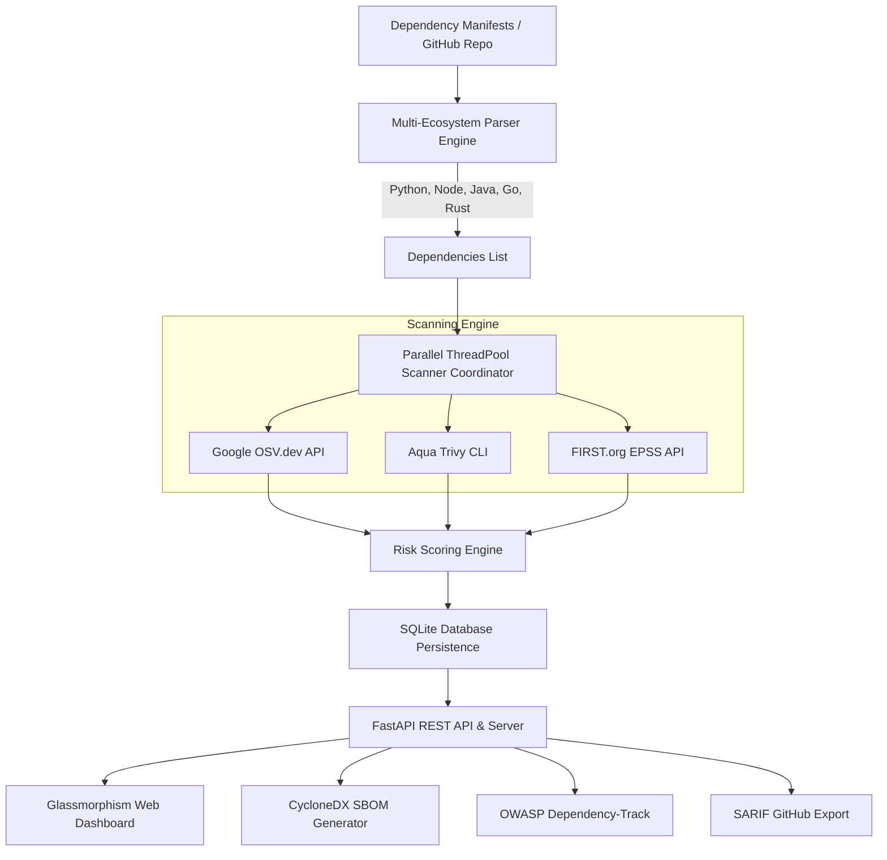

# 🛡️ DevSecOps Dependency Risk Analyzer

[](https://www.python.org/)
[](https://fastapi.tiangolo.com/)
[](https://osv.dev/)
[](https://cyclonedx.org/)
[](https://sarifweb.azurewebsites.net/)
[](LICENSE)

An enterprise-grade, full-stack **DevSecOps Dependency Risk Analyzer** built in Python and FastAPI. This tool automatically parses application dependency manifests, detects known **CVE vulnerabilities** using Google OSV.dev and Trivy, evaluates exploitability using **EPSS (Exploit Prediction Scoring System)**, calculates a **Composite DevSecOps Risk Score (0–100)**, exports **CycloneDX SBOMs**, pushes to **OWASP Dependency-Track**, and provides a **Glassmorphism Web Dashboard** with **CI/CD Quality Gates**.

---

## 📌 Key Features

- **🌐 Multi-Ecosystem Support**: Parses Python (`requirements.txt`, `pyproject.toml`), Node.js (`package.json`), Java Maven (`pom.xml`), Go (`go.mod`), and Rust (`Cargo.lock`).
- **🔍 Multi-Engine Vulnerability Scanning**:
  - **Google OSV.dev REST API**: Parallel multi-threaded querying across PyPI, npm, Maven, Go, and Crates feeds.
  - **Aqua Trivy CLI Wrapper**: Automatic fallback detection and binary execution.
  - **FIRST.org EPSS Integration**: Real-world exploit probability ratings to prioritize high-risk vulnerabilities.
- **⚡ DevSecOps Composite Risk Scoring Engine**:
  - Differentiates **Direct Dependencies** (weight: `1.0`) vs. **Transitive Dependencies** (weight: `0.65`).
  - Combines CVSS v3 ratings, EPSS probabilities, and severity penalties into a normalized **0 - 100 Risk Score**.
- **🚦 CI/CD Quality Gate**: Fails pipelines with non-zero exit codes when Critical CVEs or high-risk thresholds are breached.
- **🖥️ Glassmorphism Web Dashboard & FastAPI Backend**:
  - Drag-and-drop file upload interface.
  - GitHub repository scan bar.
  - **Chart.js Visualizations**: Donut chart for severity distribution & Line chart for historical risk trends.
- **📦 Enterprise Exporters & OWASP Integration**:
  - **CycloneDX v1.4 SBOM**: Standardized Software Bill of Materials in JSON format.
  - **OWASP Dependency-Track Integration**: Direct API endpoint (`/api/scans/{id}/push-dependency-track`).
  - **SARIF 2.1.0 Export**: Native integration with **GitHub Security Tab / Code Scanning**.
  - **Interactive HTML & JSON Reports**.

---

## 🏗️ System Architecture



---

## 🧮 Composite Risk Scoring Formula

The Risk Engine calculates dependency risk using:

$$R_{\text{dep}} = \max_{v \in \text{Vulns}} \left( \text{CVSS}_v \times (1 + \text{EPSS}_v) \right) \times W_{\text{dependency}}$$

Where:
- $W_{\text{dependency}} = 1.0$ for **Direct Dependencies**, and $0.65$ for **Transitive Dependencies**.
- $\text{EPSS}_v$: Real-world exploit probability factor ($0.0 - 1.0$).

The project's overall **Composite Risk Score (0 - 100)** is computed as:

$$\text{Risk Score} = \min \left( 100.0, \, \frac{\sum R_{\text{dep}}}{N_{\text{total}}} \times 12.0 + 15.0 \times N_{\text{critical}} + 5.0 \times N_{\text{high}} \right)$$

---

## 🚀 Quick Start

### 1. Installation

```bash
# Install Python dependencies
pip install -r requirements.txt pytest httpx
```

### 2. Start Web Server & Dashboard

```bash
python -m uvicorn server:app --host 127.0.0.1 --port 8000
```
Open **`http://127.0.0.1:8000`** in your browser to access the interactive Glassmorphism Dashboard.

### 3. CLI Scanning Command

```bash
# Scan local folder and generate HTML, JSON, SARIF & CycloneDX reports
python main.py scan ./samples --html report.html --json report.json --sarif report.sarif
```

### 4. Scan Remote GitHub Repositories

```bash
python main.py scan-github https://github.com/owner/repo --html gh_report.html
```

---

## 🐳 Docker Deployment

You can deploy the entire stack using Docker and Docker Compose:

```bash
# Build and run with Docker Compose
docker-compose up --build -d
```
Access the dashboard at `http://localhost:8000`.

---

## 🧪 Running Tests

Execute the automated `pytest` test suite:

```bash
pytest
```

Output:
```text
============================= test session starts =============================
tests/test_parsers.py ....                                               [ 44%]
tests/test_scoring.py ..                                                 [ 66%]
tests/test_server.py ...                                                 [100%]
============================= 9 passed in 14.26s ==============================
```

---

## 📂 Project Structure

```text
devsecops-dependency-analyzer/
├── main.py                     # CLI Entrypoint & Argument Parser
├── server.py                   # FastAPI Application Server & REST API
├── db.py                       # SQLite Database models & persistence
├── Dockerfile                  # Container build instructions
├── docker-compose.yml          # Docker Compose configuration
├── requirements.txt            # Python package requirements
├── README.md                   # Complete project documentation
├── analyzer/
│   ├── models.py               # Data models for Vulnerability, Dependency, RiskReport
│   ├── github.py               # GitHub repository manifest fetcher
│   ├── parsers/                # Manifest Parsers Engine
│   │   ├── base.py             # Abstract Base Parser
│   │   ├── python_parser.py    # requirements.txt & pyproject.toml parser
│   │   ├── node_parser.py      # package.json parser
│   │   ├── java_parser.py      # pom.xml parser
│   │   ├── go_parser.py        # go.mod parser
│   │   └── rust_parser.py      # Cargo.lock parser
│   ├── scanners/               # Vulnerability Scanning Engine
│   │   ├── osv_scanner.py      # Google OSV.dev REST API Scanner + EPSS caching
│   │   ├── trivy_scanner.py    # Aqua Security Trivy CLI wrapper
│   │   └── manager.py          # Parallel ThreadPoolExecutor Scanner Coordinator
│   ├── scoring/
│   │   └── risk_engine.py      # DevSecOps Composite Risk Scoring Engine
│   └── reporters/              # Multi-Format Report Generators
│       ├── terminal_reporter.py # Rich CLI Terminal UI
│       ├── html_reporter.py     # Interactive Glassmorphism HTML Generator
│       ├── json_reporter.py     # JSON Exporter
│       ├── sarif_reporter.py    # SARIF 2.1.0 GitHub Exporter
│       └── cyclonedx_reporter.py # CycloneDX v1.4 SBOM Generator
├── web/                        # Dashboard Web Frontend
│   ├── index.html              # Main HTML Glassmorphism UI
│   ├── dashboard.css           # Glassmorphism dark mode styles
│   └── app.js                  # Frontend JS & Chart.js logic
├── tests/                      # Automated pytest test suite
│   ├── test_parsers.py
│   ├── test_scoring.py
│   └── test_server.py
└── samples/                    # Test manifest samples
```

---

## 🛡️ License

Licensed under the [MIT License](LICENSE).
