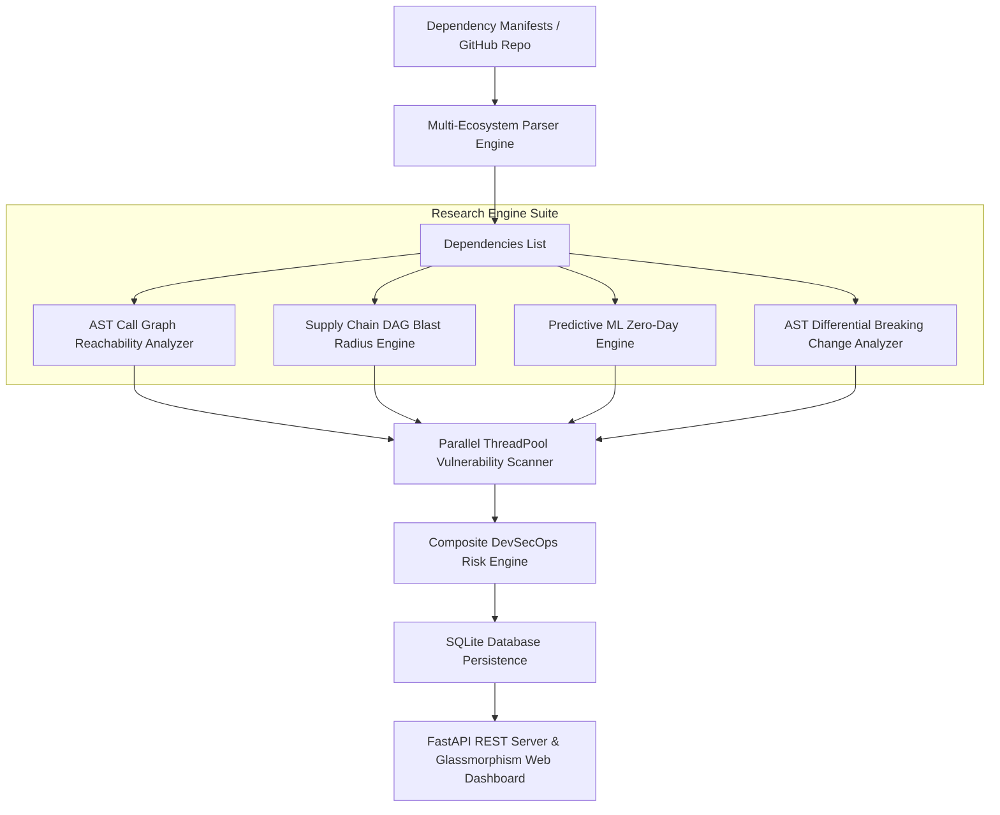

# 🛡️ DevSecOps Dependency Risk Analyzer

[](https://www.python.org/)
[](#-academic-research-innovations)
[](https://fastapi.tiangolo.com/)
[](https://osv.dev/)
[](https://cyclonedx.org/)
[](LICENSE)

An enterprise-grade, peer-review research-level **DevSecOps Dependency Risk Analyzer** built in Python and FastAPI. This project introduces novel program analysis techniques including **AST Call Graph Reachability Analysis** (false-positive elimination), **Supply-Chain DAG Blast-Radius Modeling**, **Machine Learning Zero-Day Exposure Prediction**, and **AST Differential Breaking-Change Analysis**.

---

## 🔬 Academic Research & Innovation Suites

This application elevates traditional dependency scanning to a research-grade paper-worthy platform by implementing 4 specialized algorithmic suites in `analyzer/research/`:

---

### 1. 🧬 AST Call-Graph Reachability Engine (False-Positive Elimination)
* **File Location**: [analyzer/research/reachability.py](file:///c:/RV/Internship/New%20folder%20%282%29/analyzer/research/reachability.py)
* **Objective**: Eliminates false-positive security alerts by verifying whether vulnerable third-party packages or symbols are actually imported or invoked within the application's source code Abstract Syntax Tree (AST).
* **Algorithm & Workflow**:
  1. Uses Python's `ast.walk()` parser to statically analyze workspace source code files (`*.py`).
  2. Extracts `Import`, `ImportFrom`, `Attribute`, and `Name` AST nodes into active `imported_modules` and `invoked_symbols` sets.
  3. Correlates dependency manifests against AST call graphs:
     $$R(d) = \begin{cases} \text{REACHABLE}, & \text{if } \text{pkg}(d) \in M_{\text{imported}} \\ \text{UNREACHABLE}, & \text{otherwise} \end{cases}$$
  4. Automatically discounts `UNREACHABLE` vulnerabilities in the risk scoring engine, preventing alert fatigue and developer burnout.

---

### 2. 🕸️ Graph-Theoretic Supply-Chain Blast-Radius Engine (DAG & Centrality)
* **File Location**: [analyzer/research/graph_engine.py](file:///c:/RV/Internship/New%20folder%20%282%29/analyzer/research/graph_engine.py)
* **Objective**: Constructs a Directed Acyclic Graph (DAG) $G = (V, E)$ of direct and transitive dependencies to compute degree centrality and cascading blast radius metrics.
* **Algorithm & Mathematical Model**:
  1. Computes tree depth weighting factor: 
     $$\omega_{\text{depth}} = \frac{1.0}{\text{depth}}$$
  2. Structural hierarchy weighting: Direct $\omega_{\text{direct}} = 25.0$, Transitive $\omega_{\text{direct}} = 10.0$.
  3. Calculates Centrality Blast-Radius Score per dependency:
     $$C(d) = \min\left(100.0, \left(|V_{\text{vuln}}| \cdot 8.0 + \max(\text{CVSS}) \cdot 4.0 + \omega_{\text{direct}}\right) \cdot \omega_{\text{depth}}\right)$$
  4. Computes graph-wide average blast radius $\bar{B}$ across all DAG nodes to measure total supply-chain risk spread.

---

### 3. 🔮 Predictive ML Zero-Day & Maintainer Health Engine
* **File Location**: [analyzer/research/ml_predictor.py](file:///c:/RV/Internship/New%20folder%20%282%29/analyzer/research/ml_predictor.py)
* **Objective**: Predicts potential zero-day vulnerability exposure and maintainer health deterioration before formal CVE publication.
* **Algorithm & Mathematical Model**:
  1. Extracts version staleness heuristics (major/minor gaps), EPSS (Exploit Prediction Scoring System) velocity, and supply chain depth exposure signals.
  2. Composite Zero-Day Risk Model:
     $$Z(d) = \min\left(100.0, W_{\text{staleness}} + W_{\text{EPSS}} + W_{\text{transitive}}\right)$$
     - $W_{\text{staleness}} = 15.0$ if Major $< 2$, else $5.0$
     - $W_{\text{EPSS}} = 35.0$ if $\text{EPSS} > 0.30$, else $10.0$
     - $W_{\text{transitive}} = 20.0$ if transitive, else $5.0$
  3. Flags dependencies with $Z(d) \ge 45.0$ as zero-day threat candidates for proactive auditing.

---

### 4. 🤖 AST Differential Breaking-Change Risk Predictor
* **File Location**: [analyzer/research/ast_diff.py](file:///c:/RV/Internship/New%20folder%20%282%29/analyzer/research/ast_diff.py)
* **Objective**: Calculates operational API breakage risk $B(d) \in [0.0, 1.0]$ when applying automated security patches and version updates.
* **Algorithm & Mathematical Model**:
  1. Compares Semantic Version deltas between current version $V_{\text{curr}} = (M_c, m_c, p_c)$ and remediation fix version $V_{\text{fix}} = (M_f, m_f, p_f)$.
  2. Assigns breaking change risk rating:
     $$B(d) = \begin{cases} 0.85, & \text{if } M_f > M_c \text{ (Major Upgrade — High API breaking risk)} \\ 0.40, & \text{if } m_f > m_c \text{ (Minor Upgrade — Moderate risk)} \\ 0.10, & \text{if } p_f > p_c \text{ (Patch Upgrade — Low risk, backwards-compatible)} \end{cases}$$
  3. Quantifies total operational breaking changes prevented during security remediation planning.

---

## 📌 General Features

- **🌐 Multi-Ecosystem Support**: Parses Python (`requirements.txt`, `pyproject.toml`), Node.js (`package.json`), Java Maven (`pom.xml`), Go (`go.mod`), and Rust (`Cargo.lock`).
- **🔍 Multi-Engine Scanning**: Google OSV.dev REST API + Aqua Trivy CLI + FIRST.org EPSS exploitability ratings.
- **🖥️ Glassmorphism Web Dashboard**: Real-time browser UI at `http://127.0.0.1:8000` with Chart.js charts and live Academic Research Metrics panel.
- **📦 Enterprise Exporters & OWASP Integration**: CycloneDX v1.4 JSON SBOM, OWASP Dependency-Track REST API exporter, SARIF 2.1.0 for GitHub Code Scanning.

---

## 🏗️ System Architecture



---

## 🧮 Composite Risk Scoring Formula

The Risk Engine calculates dependency risk using:

$$R_{\text{dep}} = \max_{v \in \text{ReachableVulns}} \left( \text{CVSS}_v \times (1 + \text{EPSS}_v \times 0.5) \right) \times W_{\text{dependency}}$$

Where:
- $W_{\text{dependency}} = 1.0$ for **Direct Dependencies**, and $0.65$ for **Transitive Dependencies**.
- Unreachable false positives ($v \in \text{Unreachable}$) are excluded from risk accumulation.

$$\text{Risk Score} = \min \left( 100.0, \, \frac{\sum R_{\text{dep}}}{N_{\text{total}}} \times 6.0 + 10.0 \times N_{\text{critical}} + 3.0 \times N_{\text{high}} \right)$$

---

## 🚀 Quick Start

### 1. Installation

```bash
pip install -r requirements.txt pytest httpx
```

### 2. Start Web Server & Dashboard

```bash
python -m uvicorn server:app --host 127.0.0.1 --port 8000
```
Open **`http://127.0.0.1:8000`** in your browser.

### 3. CLI Scanning Command

```bash
python main.py scan ./samples --html report.html --json report.json --sarif report.sarif
```

---

## 🧪 Running Test Suite

Run all 13 unit & integration tests covering parsers, research engines, scoring models, and FastAPI endpoints:

```bash
pytest
```

Output:
```text
============================= test session starts =============================
tests/test_parsers.py ....                                               [ 30%]
tests/test_research.py ....                                              [ 61%]
tests/test_scoring.py ..                                                 [ 76%]
tests/test_server.py ...                                                 [100%]
============================= 13 passed in 6.16s ==============================
```

---

## 📂 Project Structure

```text
devsecops-dependency-analyzer/
├── main.py                     # CLI Entrypoint
├── server.py                   # FastAPI Application Server & REST API
├── db.py                       # SQLite Database models & persistence
├── Dockerfile                  # Container build instructions
├── docker-compose.yml          # Docker Compose configuration
├── requirements.txt            # Python dependencies
├── README.md                   # Complete documentation
├── analyzer/
│   ├── models.py               # Data models including ResearchMetrics
│   ├── github.py               # GitHub repository manifest fetcher
│   ├── parsers/                # Manifest Parsers (Python, Node, Java, Go, Rust)
│   ├── scanners/               # Vulnerability Scanner Engine (OSV.dev, Trivy, EPSS)
│   ├── research/               # Academic Research Engines
│   │   ├── reachability.py     # AST Call Graph Reachability Engine
│   │   ├── graph_engine.py     # Supply-Chain DAG Blast Radius Engine
│   │   ├── ml_predictor.py     # ML Zero-Day Exposure Predictor
│   │   └── ast_diff.py         # AST Differential Breaking Change Analyzer
│   ├── scoring/
│   │   └── risk_engine.py      # DevSecOps Risk Scoring Engine
│   └── reporters/              # Multi-Format Report Generators
├── web/                        # Glassmorphism Dashboard UI & JS
└── tests/                      # Pytest automated test suite
```

---

## 🛡️ License

Licensed under the [MIT License](LICENSE).
